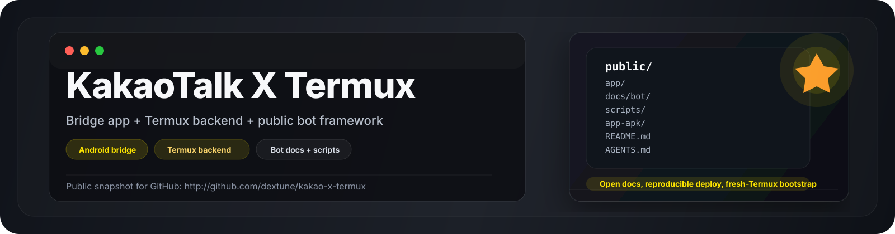
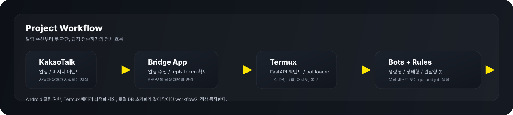
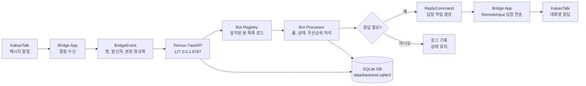

# KakaoTalk X Termux

<p align="center">
  
</p>

<p align="center">
  
</p>

KakaoTalk X Termux는 카카오톡 알림 기반 자동 응답 흐름을 검증하고 운영하기 위한 공개 배포본입니다.
이 저장소는 Android 브릿지앱, Termux 백엔드, 공개 봇 문서를 한 묶음으로 제공합니다.

## 빠른 설치

```bash
git clone https://github.com/dextune/kakao-x-termux.git
cd kakao-x-termux
./scripts/install_termux_requirements.sh
./scripts/run_termux_server.sh
./scripts/check_termux_runtime.sh
```

1. GitHub 저장소를 clone 한다.
2. Termux 안에서 `./scripts/install_termux_requirements.sh`를 실행한다.
3. `./scripts/run_termux_server.sh`로 백엔드를 띄운다.
4. `./scripts/check_termux_runtime.sh`로 상태를 확인한다.

## Android 설치

### 브릿지앱

1. `app-apk/kakao-bridge-app-debug.apk`를 설치한다.
2. Android 설정에서 브릿지앱 알림 권한을 켠다.
3. Android 설정에서 브릿지앱을 배터리 최적화 예외로 둔다.

### Termux

1. `app-apk/com.termux_1022.z01`과 `app-apk/com.termux_1022.zip`을 같은 폴더에 둔다.
2. 압축을 풀어 `com.termux_1022.apk`를 꺼낸다.
3. 꺼낸 `com.termux_1022.apk`를 설치한다.
4. 필요하면 `app-apk/com.termux.api_1002.apk`도 설치한다.
5. Android 설정에서 Termux 알림 권한을 켠다.
6. Android 설정에서 Termux를 배터리 최적화 예외로 둔다.

`install_termux_requirements.sh`는 브릿지앱 APK와 Termux 관련 배포 파일을 Download 폴더로 복사해서, 재설치할 때 다시 찾기 쉽게 만든다.

## 프로젝트 구성

| 구성 | 역할 |
| --- | --- |
| `kakao-bridge-app` | 알림 수신, reply token 확보, Termux 백엔드 연결을 담당하는 Android 브릿지앱 |
| `kakao-termux-back` | 메시지 판단, 룰 엔진, 상태 저장, 답장 작업을 처리하는 Termux 백엔드 |
| `app-apk/` | 브릿지앱 APK, Termux split ZIP, Termux:API APK |
| `scripts/` | Termux bootstrap, 서버 실행, 점검, 부팅 자동화 스크립트 |
| `docs/bot/` | 봇 작성, 운영, 테스트에 필요한 공개 문서 |

## 공식 워크플로우

KakaoTalk X Termux는 Android 앱과 Termux 백엔드를 분리해서 운영합니다.
브릿지앱은 카카오톡 알림과 답장 권한만 다루고, Termux 백엔드는 메시지 판단과 봇 실행만 담당합니다.
이 구조 덕분에 봇 로직은 Python으로 빠르게 수정할 수 있고, Android 쪽은 알림 수신과 답장 전송이라는 좁은 책임만 유지합니다.



## 처리 흐름

| 단계 | 처리 주체 | 설명 |
| --- | --- | --- |
| 1 | KakaoTalk | 새 메시지가 도착하고 Android 알림이 발생합니다. |
| 2 | Bridge App | 알림에서 방 이름, 발신자, 본문, reply token을 추출합니다. |
| 3 | Termux Backend | `/events` 계약으로 이벤트를 받고 봇 처리 파이프라인에 전달합니다. |
| 4 | Bot Registry | `app/bots/` 아래의 공개 봇 패키지를 로드하고 활성 상태를 확인합니다. |
| 5 | Bot Processor | 명령형 봇, 상태형 봇, 룰 기반 응답을 순서대로 평가합니다. |
| 6 | Reply Queue | 응답이 필요한 경우 `ReplyCommand`를 만들고 중복과 실패 상태를 관리합니다. |
| 7 | Bridge App | Android `RemoteInput`으로 실제 카카오톡 답장을 전송합니다. |

## 운영 모델

| 영역 | 기준 |
| --- | --- |
| 실행 위치 | Android 기기 안의 Termux |
| 백엔드 주소 | 기본값 `http://127.0.0.1:8787` |
| 데이터 저장 | `data/backend.sqlite3` |
| DB 보존 | 재설치와 public 최신화 과정에서 `data/`는 배포본에 포함하지 않고 보존합니다. |
| 봇 위치 | `app/bots/{bot-name}/bot.py` |
| 봇 문서 | 각 봇은 `bot.md`로 사용법과 설정을 설명합니다. |
| 설치 파일 | 브릿지앱 APK, Termux split ZIP, Termux:API APK를 `app-apk/`에 둡니다. |

## 설계 원칙

- Android 앱은 판단 로직을 갖지 않고 알림 수신과 답장 전송만 담당합니다.
- Python 백엔드는 카카오톡 앱을 직접 제어하지 않고 이벤트 처리와 응답 생성만 담당합니다.
- 봇은 독립 패키지로 작성하며, import 시점에 네트워크 요청이나 DB write 같은 부작용을 만들지 않습니다.
- public 배포본에는 운영 보조 봇, 내부 호스트 주소, 개인 환경에 의존하는 파일을 포함하지 않습니다.
- DB 파일은 GitHub 배포본에 포함하지 않으며, 처음 실행할 때 자동으로 생성합니다.
- 서버 점검은 `./scripts/check_termux_runtime.sh`와 `/health` 응답을 기준으로 합니다.

## 봇 문서

봇을 만들거나 수정할 때는 아래 문서를 순서대로 보면 됩니다.

- [문서 인덱스](docs/bot/index.md)
- [패키지 구조](docs/bot/package-structure.md)
- [런타임과 생명주기](docs/bot/runtime-lifecycle.md)
- [운영과 Hot Reload](docs/bot/operations.md)
- [테스트](docs/bot/testing.md)

## 이 저장소가 하는 일

- 카카오톡 알림을 백엔드로 전달합니다.
- 백엔드는 봇 규칙과 상태를 처리합니다.
- 브릿지앱은 실제 카카오톡 답장을 전송합니다.
- public 배포본에서는 운영 보조 봇과 내부 전용 설정을 제외합니다.

## 배포 파일

- `AGENTS.md`: public 전용 작업 안내
- `README.md`: GitHub 메인 소개
- `docs/bot/`: 봇 작성용 공개 문서
- `app-apk/`: 브릿지앱 APK, Termux split ZIP, Termux:API APK

## 저장소

GitHub: http://github.com/dextune/kakao-x-termux

## 라이선스

이 프로젝트의 사용, 복제, 수정, 재배포 조건은 저장소에 포함된 `LICENSE` 파일을 따릅니다.
`LICENSE` 파일이 없는 배포본에서는 저작권자의 명시적인 허가 없이 재배포하거나 상업적으로 사용할 수 없습니다.
